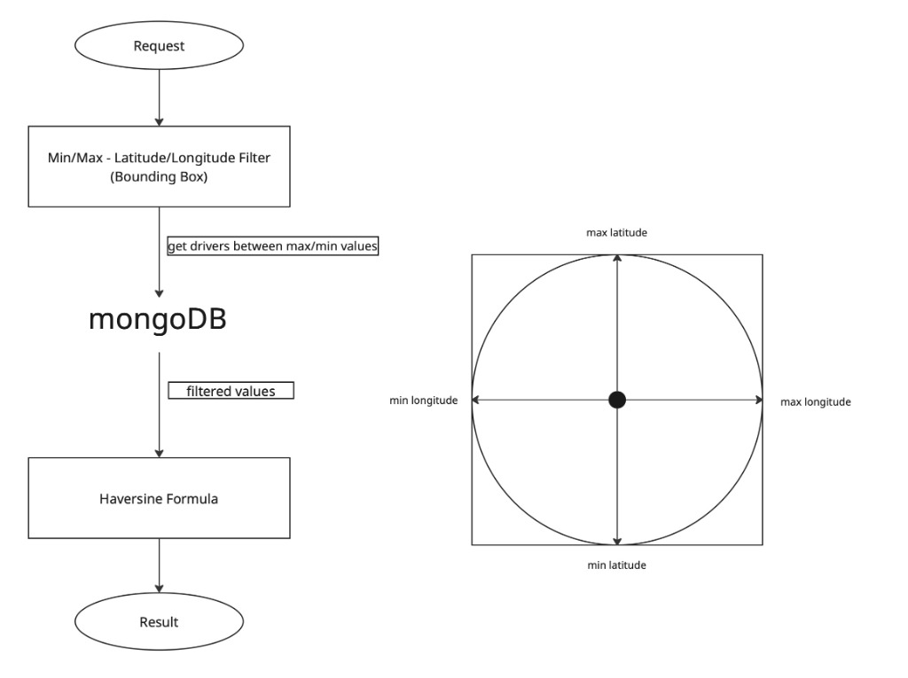
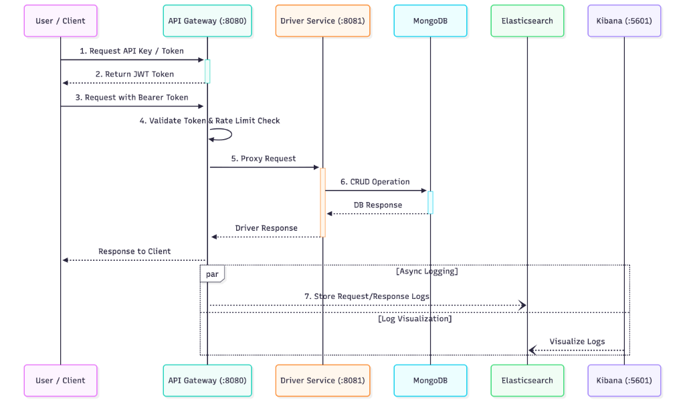

# Driver Management System

This project is a microservice-based system developed for the management and tracking of drivers. It is built using the Go (Golang) language and the Gin web framework.

## Architecture

The project consists of two main services:

1.  **API Gateway (Gateway Service):**
    * Handles all external requests.
    * **Authentication:** Validates API Keys and issues JWT tokens.
    * **Swagger Integration:** Aggregates and exposes the Driver Service's Swagger UI (running on port 8081) through the Gateway (port 8080), providing a unified documentation interface.
    * **Rate Limiting:** Protects downstream services by limiting request rates.
    * **Reverse Proxy:** Routes authenticated requests to the Driver Service.
    * **Logging:** Logs all requests and responses to Elasticsearch.

2.  **Driver Service:**
    * Manages CRUD (Create, Read, Update, Delete) operations for driver data.
    * Uses a **MongoDB** database for persistence.
    * Provides a location-based "Find Nearby Drivers" feature.

    


## Technologies

* **Language:** Go (Golang)
* **Web Framework:** Gin
* **Database:** MongoDB
* **Logging & Monitoring:** ELK Stack (Elasticsearch, Kibana)
* **Containerization:** Docker, Docker Compose
* **Documentation:** Swagger (Swaggo)

### Sequence Diagram



## Configuration & Security Note

⚠️ **For Testing Purposes:** The `.env` file (containing the `API_KEY`, `JWT_SECRET`, and database configurations) has been **intentionally committed** to this repository.

This is done to ensure the project works out-of-the-box for reviewers and testers without needing manual configuration. In a real production environment, this file would be added to `.gitignore`, and secrets would be managed securely.

## Logging & Monitoring (ELK Stack)

The system utilizes the ELK stack for comprehensive logging and monitoring:

* **Elasticsearch:** Acts as the central log store. The API Gateway asynchronously sends detailed logs (request body, response body, latency, status code, trace ID) to Elasticsearch.
* **Kibana:** Provides a web interface (`http://localhost:5601`) to visualize and query the logs stored in Elasticsearch. You can filter logs by `traceID`, status code, or endpoint to debug issues effectively.

## Authentication Flow

Authentication is secured using **JWT (JSON Web Tokens)**.

1.  **Obtain Token:** The client must first make a `POST` request to `/auth/token` with a valid `apiKey` in the body.
2.  **Receive Token:** If the API Key is valid, the Gateway returns a JWT token.
3.  **Access Protected Routes:** For all subsequent requests to the Driver Service, the client must include this token in the `Authorization` header:
    ```
    Authorization: Bearer <your_jwt_token>
    ```

## Installation and Execution

Docker and Docker Compose must be installed to run the project in your local environment.

1.  **Clone the Project:**
    ```bash
    git clone [https://github.com/kadirhanmeral/driver-management.git](https://github.com/kadirhanmeral/driver-management.git)
    cd driver-management
    ```

2.  **Start Docker Containers:**
    Run the following command in the project's root directory:
    ```bash
    docker compose up --build
    ```
    This command will start up MongoDB, Elasticsearch, Kibana, the Driver Service, and the Gateway services.

## Service Endpoints

### Gateway (Port: 8080)

The Gateway service runs at `http://localhost:8080`.

* **Swagger UI:** `http://localhost:8080/swagger/index.html`
    * *Note: This UI integrates the Driver Service's documentation, allowing you to test endpoints directly through the Gateway.*
* **Auth Token:** `POST /auth/token` (To obtain a JWT token using an API Key)

### Driver Service (Port: 8081)

The Driver service runs at `http://localhost:8081`. **It is recommended to access these endpoints via the Gateway (Port 8080) using the JWT token.**

* **Create Driver:** `POST /drivers`
* **List Drivers:** `GET /drivers?page=1&pageSize=10`
* **Driver Details:** `GET /drivers/{id}`
* **Update Driver:** `PATCH /drivers/{id}`
* **Delete Driver:** `DELETE /drivers/{id}`
* **Nearby Drivers:** `GET /drivers/nearby?lat=...&lon=...&taxiType=...`
